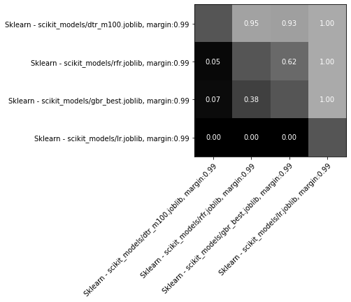

# Kaggle 2020 Christmas Competition
[Competition link](https://www.kaggle.com/c/santa-2020/overview)

My approach was to take data from high-level agent games and train a keras regressor to predict each bandit's true payout rate.  
My agent then picked the bandit with the highest expected payout at each step.

## Features
This challenge gives very little data to work with, but I improved my results by supplementing the available data with pull and win streaks.

- step number
- number of pulls
- number of opponent pulls
- reward - total reward for the agent
- streak - number of times the agent has pulled this in a row
- opponent streak - number of times the opponent has pulled in a row
- win streak - number of times this agent has given a reward in a row

## Included Agents
- Thompson Sampling
- Bayesian Upper Confidence Bound
- sklearn regression
- keras regression
- sklearn/keras ensemble
- keras classifier
- pull vegas, only used for training. [source]( https://www.kaggle.com/a763337092/pull-vegas-slot-machines-add-weaken-rate-continue5)

## multi-armed-bandit.ipynb
My main notebook file, this contains all the code to train agents and run simulations.

## santa-episode-scraper.ipynb
This notebook downloads agents, parses them into data frames, and saves them.

Based on https://www.kaggle.com/masatomatsui/santa-episode-scraper

## stats.py
Some basic statistics functions to analyze game results.
Given a list of (p1, p2) scores it will calculate the following:
- Wins for each agent
- 95% confidence interval for player 1 win probability
- Likelihood of superiority

## simulator.py
I added my own `simulator.py` code to run games in parallel and print out agent statistics.

`compare_agents` will play two agents head-to-head and stop early if one agent is clearly better
`rank_agents` efficiently ranks a list of agents using merge sort
`round_robin` takes a list of agents, plays them all against each other, and prints a grid of win percentages.

## Sources
Bayesian UCB - https://lilianweng.github.io/lil-log/2018/01/23/the-multi-armed-bandit-problem-and-its-solutions.html  
Thompson Sampling - https://www.kaggle.com/ilialar/simple-multi-armed-bandit  
Training data collection - https://www.kaggle.com/masatomatsui/santa-episode-scraper  
Decision Tree Regressor - https://www.kaggle.com/lebroschar/1000-greedy-decision-tree-model  
Ray support - https://www.kaggle.com/nigelcarpenter/parallel-processing-agent-trials-using-ray  
Pull Vegas - https://www.kaggle.com/a763337092/pull-vegas-slot-machines-add-weaken-rate-continue5
   